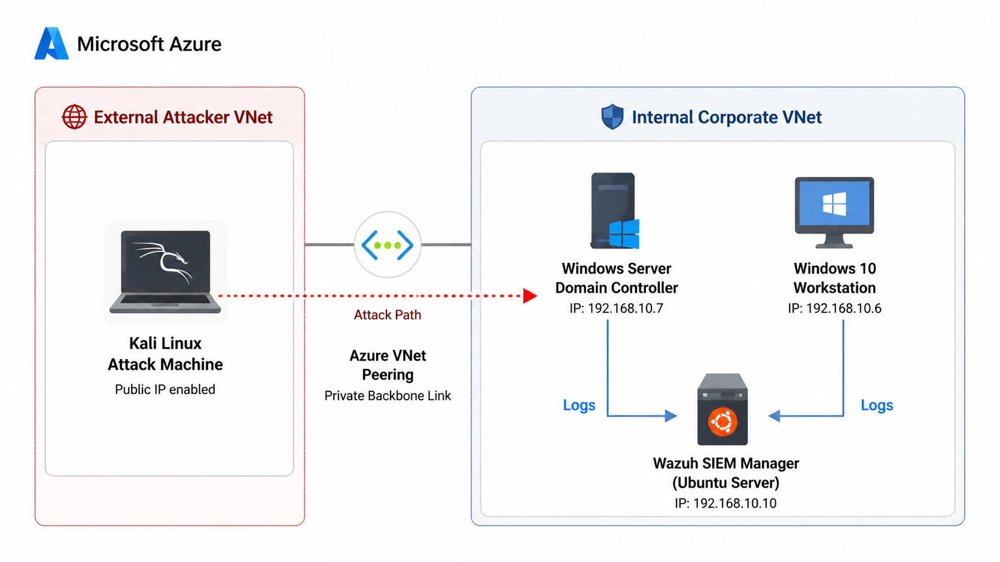
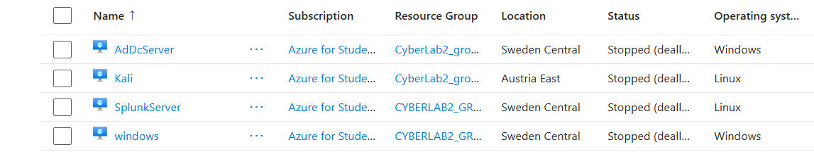

# Azure Cloud Security Architecture: Network, SIEM Deployment & Threat Detection

## Project Overview

This project was designed as a hands-on cloud security training lab inside Microsoft Azure. The main purpose was to learn cloud architecture, network segmentation, secure remote administration, and security monitoring by building a realistic environment with multiple virtual machines connected in different zones.

Instead of studying cloud security only in theory, I used Azure to practice how different systems can be deployed, isolated, connected, and monitored in a controlled environment. This made the project useful both as a cloud learning exercise and as a security validation lab.

---

## What I Built

The lab was built to simulate a small enterprise environment with different machine roles and functions:

- a **Windows Server Domain Controller** for Active Directory.
- a **Windows 10 workstation** for user interaction and authentication testing.
- an **Ubuntu Server** used as the **Wazuh SIEM Manager**.
- a **Kali Linux machine** used from a separate network zone for offensive testing.

The goal was to understand how to create virtual machines with different responsibilities and interconnect them securely inside a cloud network. I also wanted to validate what happens when a machine from another zone, such as Kali, tries to reach internal corporate assets.

---

## Azure Constraints And Design

Because the lab was created using a **Student Free Tier** account, public IP addresses were limited. That constraint shaped the architecture and became part of the learning experience.

- The **Domain Controller** had only a private IP: `192.168.10.7`.
- The **Windows 10** machine had a public IP and a private IP: `192.168.10.6`.
- The **Kali Linux** machine was placed in a separate network because of the account limitations.
- The **Ubuntu/Wazuh server** was accessed internally and used as the Wazuh SIEM collection point.

Since the Kali machine had to live in a different network zone, I used **Azure VNet Peering** to connect both environments. This was an important part of the project because it taught me how to link separate zones through the Azure backbone while keeping network segmentation in place.

---

## Access And Administration

The internal Domain Controller had no public IP, so I used **Azure Bastion** to access it securely without exposing the server directly to the internet. That was a practical lesson in secure administration and private access to cloud resources.

The access methods used in the lab were:

- **Azure Bastion** for the Domain Controller.
- **SSH** for the Kali Linux machine and the Ubuntu server.
- **RDP** for the Windows machine.

This setup helped me understand how cloud administration changes depending on the operating system, network exposure, and security design.

---

## Security Monitoring And Testing

After the infrastructure was deployed, I added monitoring and attack simulation to validate the environment.

I installed **Wazuh** on the Ubuntu server to centralize logs from the Windows machines, and I used **Sysmon** on the Domain Controller to capture detailed endpoint telemetry. This allowed me to observe authentication events, process creation, PowerShell activity, and suspicious commands in a single dashboard.

To test the detection pipeline, I ran controlled offensive simulations using **Hydra** and **Atomic Red Team**. These tests generated events such as failed logons, successful RDP sessions, suspicious PowerShell execution, and local user creation.

---

## What I Learned

This project taught me several important lessons about cloud security and infrastructure design:

- how to build and connect virtual machines with different roles inside Azure.
- how to work around public IP limitations in a student cloud account.
- how VNet Peering can be used to connect isolated zones securely.
- how to access private systems using Azure Bastion.
- how to separate administrative access by protocol, using Bastion, SSH, and RDP depending on the target system.
- how to collect and correlate logs in Wazuh.
- how to validate whether detections are working by generating real telemetry.
- how to distinguish normal cloud noise from malicious activity during threat hunting.

The biggest takeaway was that cloud security is not only about deploying machines, but also about designing the network, controlling access, and making sure the environment is observable.

---

## Why This Project Matters

This lab was more than just a technical setup. It was a training environment for cloud learning, detection engineering, and blue team analysis. By building everything in Azure, I was able to practice real-world cloud decisions such as segmentation, routing, access control, telemetry collection, and investigation.

It also showed me how important it is to understand both the infrastructure side and the security side of cloud environments. That combination is what makes the project valuable for future cloud, SOC, or security engineering work.

---

## Technologies Used

- Microsoft Azure
- Azure VNet Peering
- Azure Bastion
- Active Directory
- Windows Server
- Windows 10
- Ubuntu Server
- Wazuh SIEM
- Sysmon
- Kali Linux
- Hydra
- Atomic Red Team
- MITRE ATT&CK

---

## Conclusion

This project helped me develop practical skills in cloud architecture, secure access, network isolation, and security monitoring. It also gave me experience working within Azure limitations and turning them into part of the learning process.

The result was a realistic lab that connected multiple VMs across different zones and supported both cloud engineering and cybersecurity training.
